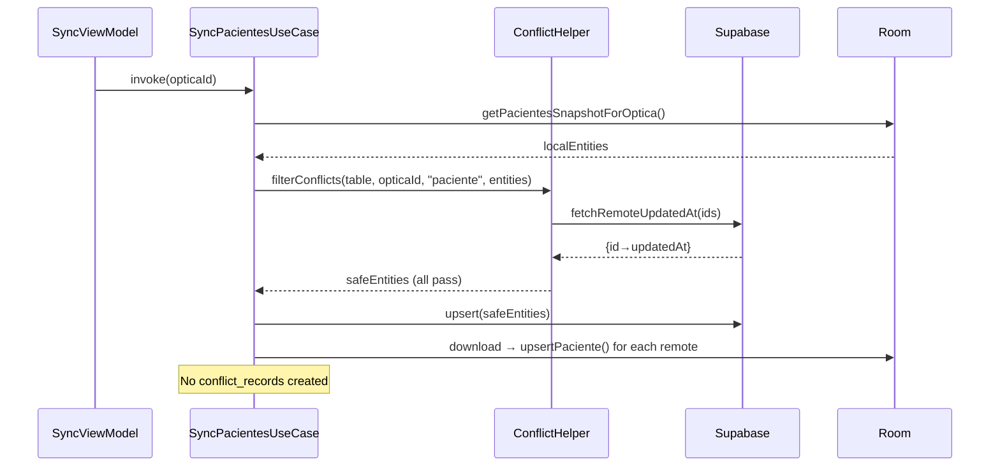
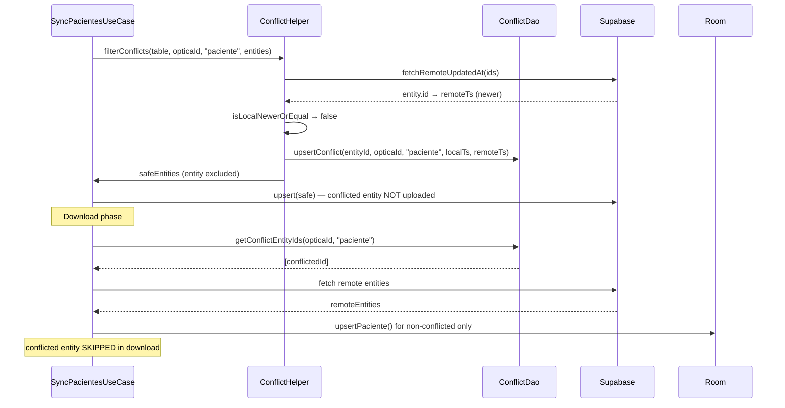
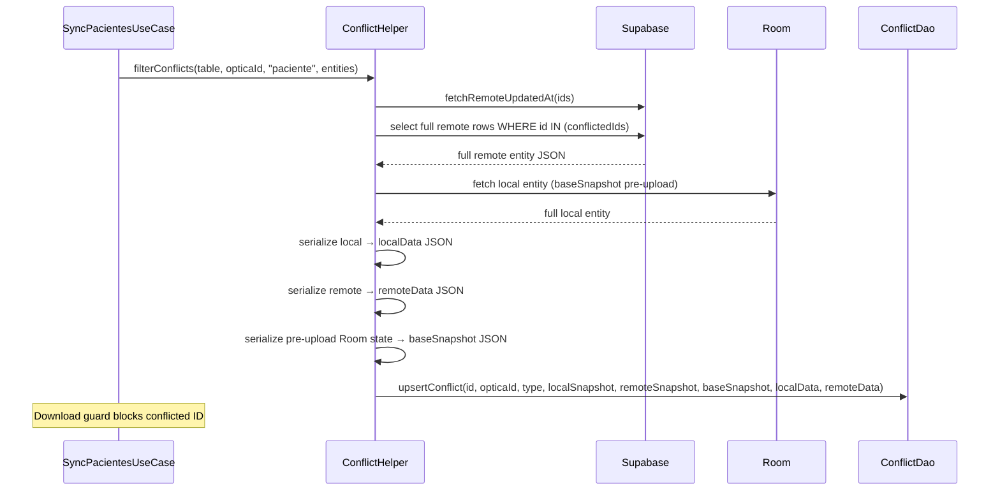
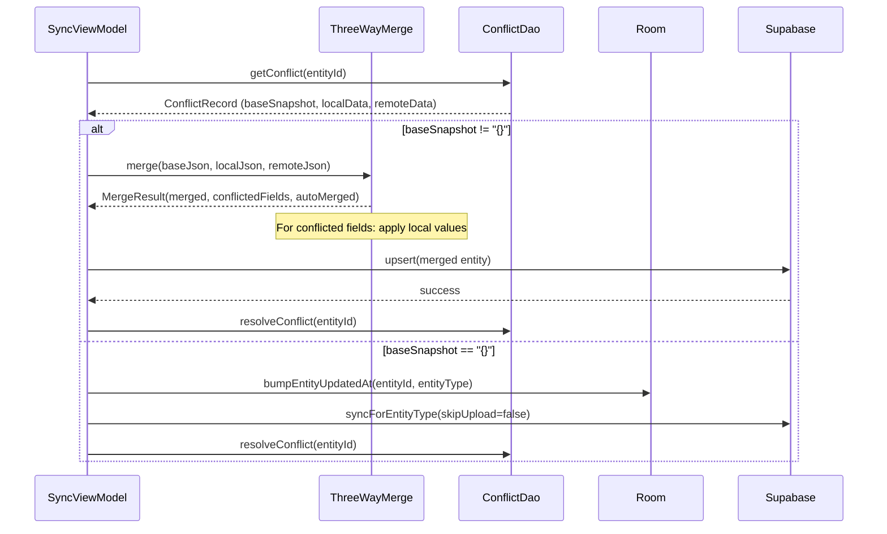
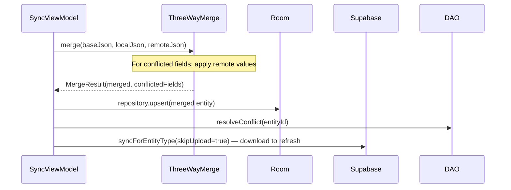
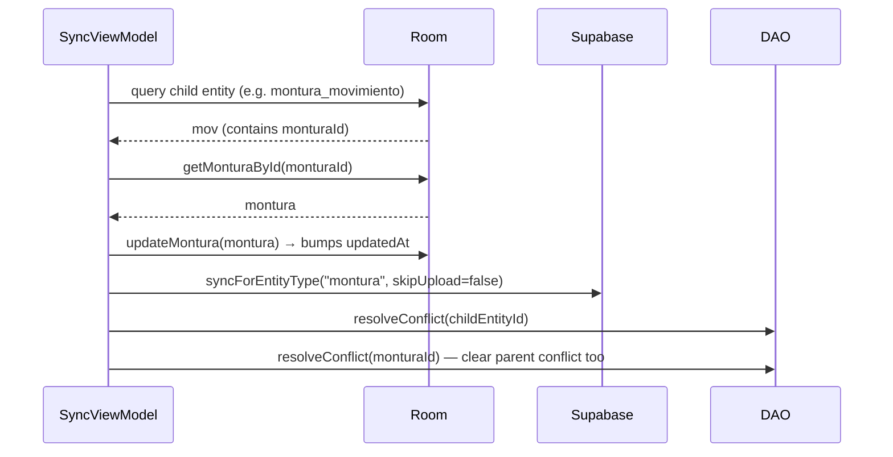

# Design: Complete Sync Conflict Protection

## Technical Approach

Phase A extends the `fix-servicios-conflictos` download-guard + bump pattern from 3→15 entity types by injecting `ConflictDao` into every UseCase and adding 12 `when` branches to `bumpEntityUpdatedAt`. Phase B replaces the timestamp-bump trick with three-way field-level merge using full-entity JSON snapshots stored in `conflict_records` (migration v27→v28), a pure `ThreeWayMerge` class, and field-level diff display in `ConflictosScreen`.

## Architecture Decisions

| # | Decision | Options considered | Chosen | Rationale |
|---|----------|-------------------|--------|-----------|
| 1 | **ConflictDao injection** | a) Inject into each UseCase directly | a) | Already done in `DownloadSyncCoordinator` (line 24); consistent with spec FR-02. Alternative (inject into ConflictHelper) would make ConflictHelper a god object with both upload and download responsibilities. |
| 2 | **Child→parent bump** | a) Static map in ViewModel; b) Polymorphic `Bumpable` interface per entity | a) | Simpler, no entity interface changes. Map: `montura_movimiento→montura`, `orden_compra_item→orden_compra`, `dispensacion_item→dispensacion`, `categoria_montura→(none)`. `inventario_fisico_detalle→inventario_fisico` EXCLUDED — parent has no `updatedAt` field, bump would be meaningless. Must query child entity first to extract parent FK. |
| 3 | **Snapshot format** | a) `kotlinx.serialization` JSON of full entity; b) Custom key-value pairs | a) | Already in project; entity DTOs are `@Serializable`. `baseSnapshot` = JSON of entity state pre-upload (fetched from Room before upload); `localData` = current Room entity; `remoteData` = full Supabase row. Empty base = `"{}"`. |
| 4 | **ThreeWayMerge location** | a) `domain/sync/ThreeWayMerge.kt` as pure class; b) Methods on ConflictHelper | a) | Pure logic, no dependencies. Testable without Room/Supabase mocks. ConflictHelper already has 290 lines — adding 150 more violates SRP. |
| 5 | **Snapshot capture timing** | a) Inside `filterConflicts` when conflict detected; b) Deferred/lazy in ViewModel | a) | Capture at detection time ensures snapshots reflect state at conflict moment, not at resolution time (entity may have been modified further). One extra Supabase query per conflicted entity — acceptable (conflicts are rare). |
| 6 | **Room migration** | a) Non-destructive ALTER TABLE; b) Destructive drop/recreate | a) | `conflict_records` is a small table (tens of rows). Three `ALTER TABLE ADD COLUMN` statements are safe. Precedent: the project already uses destructive migrations only for schema mismatches, not column additions. |
| 7 | **Fallback detection** | a) Check `baseSnapshot == "{}"`; b) Check column IS NULL | a) | Migration sets DEFAULT `'{}'`; Kotlin default is also `"{}"`. Simple string comparison avoids null checks. Both new and legacy rows match. |
| 8 | **Upload flow for blind entities** | a) Add `filterConflicts` to `uploadDispensacionItems`, `uploadArqueos`; b) Leave blind | a) for `uploadDispensacionItems` + `uploadArqueos` (have `updatedAt`); b) for `uploadCategorias`, `uploadItems`, `uploadDetalles` | `uploadItems` and `uploadDetalles` lack `updatedAt` on their DTOs; adding conflict detection requires schema change beyond scope. `uploadDispensacionItems` already has `updatedAt` in its remote DTO. Also: `filterConflictMovimientos` MUST now create `conflict_records` rows (currently it only marks in SyncStateTracker), otherwise download guard for `montura_movimiento` is a no-op. |
| 9 | **Fail-open on ConflictDao error** | a) Log + proceed; b) Throw + abort download | a) | FR-01 Scenario 4 requires fail-open. A ConflictDao query failure is a local DB issue, not a data integrity threat. Logging + proceeding means the download isn't blocked by a transient Room error. |
| 10 | **inventario_fisico exclusion** | a) Exclude from all protection layers; b) Add `updatedAt` field | a) | `InventarioFisico` entity has NO `updatedAt` field (only id, fecha, estado, opticaId, userId, notas). Adding one requires Room migration + Supabase schema change + migration data backfill — scope creep. The entity is sequential (one session at a time per optica), so conflicts are rare. Excluded from download guard, bump, child→parent mapping, and ConflictDao injection. |
| 11 | **filterConflictMovimientos persistence** | a) Add `conflictDao.upsertConflict()` call; b) Create separate conflict records from caller | a) | `filterConflictMovimientos` currently detects stock conflicts purely in memory. Without `conflict_records` persistence, download guard for `montura_movimiento` is a no-op. Adding `upsertConflict` to `filterConflictMovimientos` mirrors `filterConflicts` and enables the guard. |

## Sequence Diagrams

### 1. Normal sync (no conflict)



### 2. Sync with conflict (current behavior — Phase A)



### 3. Sync with conflict + snapshot (Phase B)



### 4. resolveKeepMine with three-way merge (Phase B)



### 5. resolveAcceptTheirs with three-way merge



### 6. Child entity conflict resolution



## File Changes

### Phase A

| File | Action | Description |
|------|--------|-------------|
| `data/ConflictRecord.kt` | **Modify** | Add `ConflictDao.getConflictEntityIds` — already exists (line 55-56), no change needed |
| `domain/SyncPacientesUseCase.kt` | **Modify** | Add `conflictDao: ConflictDao` param; guard in `download()`: fetch conflicted IDs → skip matching remotos |
| `domain/SyncHistorialUseCase.kt` | **Modify** | Add `conflictDao` param; guard in `downloadEvaluaciones()` |
| `domain/SyncInventarioUseCase.kt` | **Modify** | Add `conflictDao` param; guard in `downloadMonturas()` + `downloadMovimientos()` |
| `domain/SyncProveedoresUseCase.kt` | **Modify** | Add `conflictDao` param; guard in `downloadProveedores()` + `downloadCategorias()`; existing `uploadCategorias` stays blind |
| `domain/SyncOrdenesCompraUseCase.kt` | **Modify** | Add `conflictDao` param; guard in `downloadOrdenesCompra()` + `downloadItems()` |
| `domain/SyncInventarioFisicoUseCase.kt` | **No change** | EXCLUDED — entity has no `updatedAt`, `filterConflicts` never creates conflict_records. Guard would be no-op. |
| `domain/DownloadSyncCoordinator.kt` | **Modify** | Guard in `downloadDispensacionItems()` + `downloadArqueos()` (conflictDao already injected, line 24) |
| `domain/UploadSyncCoordinator.kt` | **Modify** | Add `filterConflicts` to `uploadDispensacionItems()` and `uploadArqueos()` |
| `viewmodel/SyncViewModel.kt` | **Modify** | Extend `bumpEntityUpdatedAt` with 6 branches: `paciente→updatePaciente`, `evaluacion→updateEvaluacion`, `montura→updateMontura`, `proveedor→ProveedorRepository.update` (needs updatedAt wrapping), `orden_compra→OrdenCompraRepository.update` (already stamps), `arqueo_caja→updateArqueo` (needs updatedAt stamp). Child mapping branches: `montura_movimiento→fetch mov→getMonturaById→updateMontura`, `orden_compra_item→fetch item→getById→update`, `dispensacion_item→fetch item→getDispensacionById→updateDispensacion`, `categoria_montura→log skip`. `inventario_fisico` and `inventario_fisico_detalle` EXCLUDED (no updatedAt). |
| `data/ProveedorRepository.kt` | **Modify** | `update()` already delegates to DAO — wrap with `copy(updatedAt = Instant.now().toString())` before calling `proveedorDao.update(stamped)` |
| `data/OptoRepository.kt` | **Modify** | `updateArqueo()` needs `copy(updatedAt = Instant.now())` stamping (currently raw DAO pass-through, lines 149-152) |
| `data/OrdenCompraRepository.kt` | **None** | `update()` (line 50-53) already stamps `updatedAt = Instant.now().toString()` |
| `data/InventarioFisicoRepository.kt` | **No change** | EXCLUDED — no updatedAt field in entity |
| `domain/sync/ConflictHelper.kt` | **Modify** | Add `conflictDao.upsertConflict()` call inside `filterConflictMovimientos()` for each conflicted ID. Mirror the pattern from `filterConflicts()` lines 146-152. This enables the `downloadMovimientos` guard. |
| `ui/screens/ConflictosScreen.kt` | **Modify** | Extend `TYPE_LABELS` with all 15 entries from FR-06 (inventario_fisico labels still useful for display, even without protection) |

### Phase B

| File | Action | Description |
|------|--------|-------------|
| `data/sync/ConflictRecord.kt` | **Modify** | Entity: add `baseSnapshot: String = "{}"`, `localData: String = "{}"`, `remoteData: String = "{}"`. DAO: update `upsertConflict` SQL to include 3 new columns. Add `getConflictSnapshot` query: `SELECT baseSnapshot, localData, remoteData FROM conflict_records WHERE entityId = :id AND opticaId = :opticaId` |
| `data/OptoDatabase.kt` | **Modify** | Bump `version = 28`, add `MIGRATION_27_28`, register in `getDatabase()` |
| `data/OptoDatabaseMigrations.kt` | **Modify** | Create `val MIGRATION_27_28`: three `ALTER TABLE conflict_records ADD COLUMN` statements with NOT NULL DEFAULT '{}' |
| `domain/sync/ThreeWayMerge.kt` | **Create** | Pure class with `fun <T> merge(input: MergeInput, fromJson: (JsonObject) -> T, toJson: (T) -> JsonObject): MergeResult<T>`. Field-by-field comparison per FR-09 rules. |
| `domain/sync/EntitySnapshotSerializer.kt` | **Create** | Serialization helpers: `suspend fun fetchLocalEntity(type, id): String` (despatch to correct DAO), `fun serializeRemoteRow(row: JsonElement): String`, `fun parseSnapshot(json: String): JsonObject` |
| `domain/sync/ConflictHelper.kt` | **Modify** | In `filterConflicts`, after conflict detection (line 146): fetch full remote row from Supabase (`select * where id = entity.id`), serialize to `remoteData`. Fetch current local entity from Room via new DAO query, serialize to `localData`. Read base snapshot from Room pre-upload snapshot. Pass all to `upsertConflict`. Add helper `serializeToJson(entity: Any): String` using `kotlinx.serialization`. |
| `viewmodel/SyncViewModel.kt` | **Modify** | `resolveKeepMine`: if snapshots present, call `ThreeWayMerge.merge()`, apply local wins, upsert merged, clear conflict. If baseSnapshot="{}", fallback to existing bump. `resolveAcceptTheirs`: same with remote wins. Remove bump call from snapshot path. |
| `ui/screens/ConflictosScreen.kt` | **Modify** | `ConflictCard`: if `conflict.baseSnapshot != "{}"`, compute `MergeResult` via `ThreeWayMerge.merge(parse base, parse localData, parse remoteData)` in a `LaunchedEffect`, show `conflictingFields` as list with local/remote values. Display auto-merged count. Fallback to timestamp display if empty snapshots. |

## Key Data Structures

```kotlin
// Enhanced ConflictRecord (Phase B)
@Entity(tableName = "conflict_records")
data class ConflictRecord(
    @PrimaryKey val entityId: String,
    val opticaId: String,
    val entityType: String,
    val localSnapshot: String,
    val remoteSnapshot: String,
    val baseSnapshot: String = "{}",
    val localData: String = "{}",
    val remoteData: String = "{}",
    val detectedAt: Long = System.currentTimeMillis()
)

// Three-way merge input/output
data class MergeInput(
    val baseJson: JsonObject,
    val localJson: JsonObject,
    val remoteJson: JsonObject
)

data class MergeResult<T>(
    val mergedEntity: T,
    val conflictedFields: List<String>,
    val autoMergedFields: List<String>,
    val hasConflict: Boolean
)

// ConflictDao additions
@Query("SELECT baseSnapshot, localData, remoteData FROM conflict_records WHERE entityId = :entityId AND opticaId = :opticaId")
suspend fun getConflictSnapshot(entityId: String, opticaId: String): ConflictSnapshot?

data class ConflictSnapshot(val baseSnapshot: String, val localData: String, val remoteData: String)
```

## Migration SQL (v27→v28)

```sql
ALTER TABLE conflict_records ADD COLUMN baseSnapshot TEXT NOT NULL DEFAULT '{}';
ALTER TABLE conflict_records ADD COLUMN localData TEXT NOT NULL DEFAULT '{}';
ALTER TABLE conflict_records ADD COLUMN remoteData TEXT NOT NULL DEFAULT '{}';
```

## Testing Strategy

| Layer | What to Test | Approach | Files |
|-------|-------------|----------|-------|
| **Unit** | Download guard per entity type (×10) | mockk ConflictDao, assert conflicted IDs skipped, non-conflicted downloaded. `inventario_fisico` + `inventario_fisico_detalle` excluded. | 10 test files, one per UseCase |
| **Unit** | Bump per entity type (×6 parent) | mockk repository, verify correct update method called with stamped entity. `inventario_fisico` excluded. | `SyncViewModelBumpCoverageTest.kt` |
| **Unit** | Child→parent bump (×3) | mockk DAOs, verify parent entity is fetched and updated. `inventario_fisico_detalle` excluded. | `SyncViewModelChildBumpTest.kt` |
| **Unit** | filterConflictMovimientos creates conflict_records (×2) | mockk conflictDao, verify upsertConflict called for stock conflicts, not for non-conflicted | `ConflictHelperMovimientoPersistenceTest.kt` |
| **Unit** | ThreeWayMerge logic (×8 scenarios) | Pure function — no mocks needed. 8 test cases: all-unchanged, local-only, remote-only, overlapping, different-fields, all-conflicting, empty-base, missing-fields | `ThreeWayMergeTest.kt` |
| **Unit** | Snapshot serialization round-trip | Serialize Paciente/Montura/OrdenCompra → JSON → deserialize, verify field equality | `EntitySnapshotSerializerTest.kt` |
| **Unit** | ConflictHelper snapshot capture | mockk Supabase + DAOs, verify full remote row fetched, local entity serialized, base snapshot read, all passed to upsertConflict | `ConflictHelperSnapshotTest.kt` |
| **Integration** | resolveKeepMine with three-way merge | In-memory Room DB + fake ThreeWayMerge, verify merged entity uploaded, conflict cleared | `SyncViewModelThreeWayMergeTest.kt` |
| **Migration** | MIGRATION_27_28 | Create v27 DB with 5 conflict_records rows, run migration, verify 3 new columns exist with DEFAULT '{}', existing data preserved | `Migration27To28Test.kt` |
| **UI** | ConflictCard snapshot display | Compose test: render card with snapshot data, verify per-field diffs rendered | `ConflictosScreenSnapshotTest.kt` |

## Closed Questions (Resolved by Audit)

- [x] `InventarioFisico` entity: does it have an `updatedAt` field? **RESOLVED**: No, it does not. Entity fields are: id, fecha, estado, opticaId, userId, notas. EXCLUDED from all protection layers (download guard, bump, child→parent mapping, ConflictDao injection). Entities are sequential — one session at a time per optica — rendering conflicts unlikely.
- [x] `filterConflictMovimientos` no-op download guard: **RESOLVED**: Added `conflictDao.upsertConflict()` call to `filterConflictMovimientos` as part of this change. Without it, `downloadMovimientos` guard is meaningless.
- [x] `resolveAcceptTheirs` with snapshots — no upload: **CONFIRMED INTENTIONAL**: Merged entity (remote wins) matches server state. Uploading would bump local `updatedAt`, re-triggering conflicts. Current `skipUpload = true` behavior is preserved.
