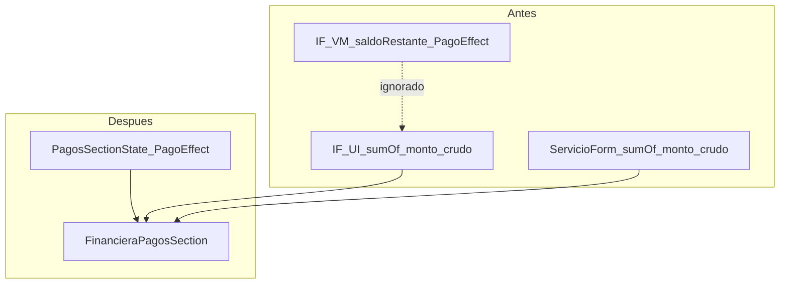

# Design: UX Unificado Integral

## Context

Ledger (#55 + #56) está en `main`. `PagoEffect` ya gobierna los agregados de `CierreCajaViewModel`, `ReportesViewModel`, `ServiciosViewModel`, `DispensacionViewModel` y `FinancieraUiState.saldoRestante`.

Lo que queda es **UX**: las pantallas todavía calculan y presentan dinero por su cuenta, duplican el bloque de abonos y usan shells ad-hoc.

### Estado verificado en `main` post-ledger

| Hecho | Evidencia |
|-------|-----------|
| VM de cierre ya usa `PagoEffect` | `CierreCajaViewModel.observePagos`, `getTotalesPorMetodo` |
| `FinancieraUiState.saldoRestante` usa `PagoEffect` | `InformacionFinancieraViewModel:36` |
| La UI de IF **no** usa el VM: recalcula `pagos.sumOf { it.monto }` | `InformacionFinancieraScreen:115` |
| `ServicioForm` repite el mismo cálculo crudo | `ServicioForm:109` |
| `IF.save()` no persiste `montoPagado` | `InformacionFinancieraViewModel:120-161` |
| No existe `actualizarMontoPagado` en el repo IF | `DispensacionFinancieraRepository:14-25` |
| Sí existe cálculo effect-aware reutilizable | `CalcularMontoPagadoUseCase` + `PagoDao.sumMontoByDispensacion` |
| Regalos viven en el wizard | `NuevaDispensacionScreen:328` → `DispensacionFormSections.RegalosSection:291` |
| `FormActions` existe pero ninguna pantalla lo usa | `ui/components/FormActions.kt` |

### Divergencia que este diseño elimina



Con `Reembolso`/`Reverso` en juego, la UI actual muestra un saldo distinto al del dominio. Ese es el bug real que motiva REQ-UX-INT-001 y REQ-UX-INT-002.

## Goals

1. Una sola implementación de la sección de pagos, alimentada por `PagoEffect`.
2. `montoPagado` de la dispensación deja de derivar del wizard: IF pasa a ser el escritor.
3. Shell de formulario y card de contexto de paciente compartidos, sin cambiar la navegación existente.

## Non-goals

- No se toca el esquema Room ni migraciones (ledger ya cerró eso).
- No se cambia la lógica de sync ni los writers de inventario.
- No se reescribe el wizard de evaluación (sigue con 5 pasos).

## Decisions

### D1 — `FinancieraPagosSection` recibe estado, no ViewModel

`InformacionFinancieraScreen` usa Hilt VM; `ServicioForm` recibe estado por parámetros desde `ServiciosViewModel`. Para servir a ambos sin acoplar, el composable es **stateless**:

```kotlin
data class PagosSectionState(
    val montoTotal: Double,
    val pagos: List<Pago>,
) {
    val pagado: Double get() = pagos.sumOf { PagoEffect.signedAmount(it.tipo, it.monto) }
    val saldo: Double get() = montoTotal - pagado

    fun montoMaximoParaNuevo(): Double = saldo.coerceAtLeast(0.0)

    fun montoMaximoParaEdicion(pagoId: String): Double {
        val otros = pagos.filter { it.id != pagoId }
            .sumOf { PagoEffect.signedAmount(it.tipo, it.monto) }
        return (montoTotal - otros).coerceAtLeast(0.0)
    }
}

@Composable
fun FinancieraPagosSection(
    state: PagosSectionState,
    onAddPago: (Pago) -> Unit,
    onUpdatePago: (Pago) -> Unit,
    onRemovePago: (Pago) -> Unit,
    modifier: Modifier = Modifier,
)
```

**Rationale:** `PagosSectionState` es una clase pura, testeable con JUnit sin Compose. Los cálculos de tope (`montoMaximo*`) hoy están inline y duplicados con semántica cruda; centralizarlos corrige el tope cuando hay reembolsos.

**Alternativa descartada:** pasar el VM de IF al composable. Obligaría a `ServiciosViewModel` a implementar una interfaz común solo para UI y acoplaría el componente al ciclo de vida.

### D2 — `IF.save()` recalcula `montoPagado` dentro de la misma transacción

`DispensacionFinancieraRepository` gana un método:

```kotlin
suspend fun actualizarMontoPagado(dispensacionId: String, montoPagado: Double, opticaId: String)
```

`InformacionFinancieraViewModel.save()` lo llama **después** de aplicar altas/ediciones/bajas, dentro del `withTransaction` existente, usando el mismo criterio effect-aware que el resto del dominio.

**Rationale:** `CierreCajaViewModel` calcula `saldoPendiente` con el campo entidad `montoPagado`. Hoy, editar pagos solo en IF deja ese campo obsoleto y el cierre miente. `DispensacionViewModel.saveDispensacion` ya escribe `montoPagado`; IF debe hacer lo mismo o el hub queda a medias.

**Fuente del valor:** `CalcularMontoPagadoUseCase` (delega en `PagoDao.sumMontoByDispensacion`, que aplica la matriz de efecto en SQL). Se invoca tras persistir los pagos para que lea el estado ya escrito, no el borrador en memoria.

### D3 — `OptoFormShell` envuelve, no reemplaza

```kotlin
@Composable
fun OptoFormShell(
    title: String,
    onNavigateBack: () -> Unit,
    onSave: (() -> Unit)? = null,
    bottomBar: @Composable (() -> Unit)? = null,
    snackbarHostState: SnackbarHostState = remember { SnackbarHostState() },
    content: @Composable ColumnScope.() -> Unit,
)
```

Compone `Scaffold` + `OptoTopAppBar` + scroll vertical + `navigationBarsPadding`, que es el patrón repetido en paciente, evaluación, dispensación, servicio e IF. `bottomBar` acepta `FormActions` (ya existe, sin uso en pantallas) o los controles de wizard.

**Rationale:** las cinco pantallas comparten el mismo esqueleto con variaciones menores. Un wrapper preserva el árbol de composición actual, así los tests de UI existentes siguen encontrando sus nodos.

### D4 — `PatientContextCard` desde el card de IF

Se extrae el card de contexto de `InformacionFinancieraScreen:88-101`, no `PacienteInfoHeader` (ese es el header rico de la pantalla de detalle, con otra responsabilidad).

```kotlin
@Composable
fun PatientContextCard(
    pacienteNombre: String,
    ot: String? = null,
    fecha: LocalDate? = null,
    descripcion: String? = null,
    modifier: Modifier = Modifier,
)
```

`ot` es nullable porque evaluación y servicio no siempre tienen OT.

### D5 — Regalos se mueven en la Fase 4, no antes

Mover `RegalosSection` implica tocar `DispensacionViewModel.saveDispensacion`, que hoy también escribe `montoPagado` y descuenta stock. Se hace **después** de que D2 esté en verde, para que IF ya sea escritor válido de `montoPagado` cuando el wizard deje de serlo.

## Risks

| Riesgo | Mitigación |
|--------|------------|
| Cambiar el saldo visible de IF altera expectativas de usuario | Con solo `Abono`/`Pago completo` el valor no cambia; solo difiere con reembolsos, donde el valor actual es incorrecto |
| Doble escritura de `montoPagado` (wizard + IF) | Ambos derivan del mismo cálculo effect-aware; en Fase 4 el wizard deja de manejar pagos |
| `FormActions` sin uso puede tener API inadecuada | Se valida contra los cinco call sites antes de adoptarla; se ajusta en U1 si hace falta |
| Regresión en tests de UI instrumentados | `OptoFormShell` conserva el orden del árbol; `DispensacionFlowTest` usa `PagosSection` (huérfano) y se migra en Fase 4 |

## Rollback

Cada PR de la cadena es independiente y revertible:

- U1 solo agrega componentes y reemplaza dos bloques inline; revertir restaura los bloques.
- U2 no toca dominio (los agregados ya son PagoEffect en `main`).
- U4 es el único con cambio de persistencia (`actualizarMontoPagado`); revertir devuelve el campo a la escritura del wizard.

Sin migraciones, sin cambios de esquema Supabase, sin cambios de RLS.

## Test strategy

| Nivel | Qué cubre |
|-------|-----------|
| JUnit puro | `PagosSectionState`: saldo con reembolso, topes de edición/alta, saldo negativo |
| JUnit + MockK | `InformacionFinancieraViewModel.save()` persiste `montoPagado` effect-aware; orden dentro de la transacción |
| Regresión | Suite completa por PR; `CierreCajaViewModelTest` protege los agregados ledger |

AGENTS.md prohíbe Robolectric en tests nuevos, así que la lógica que importa vive en `PagosSectionState` (clase pura) y el composable queda como capa de render sin cálculo propio. Los tests Robolectric existentes (`FormActionsTest`) se mantienen sin tocar.
