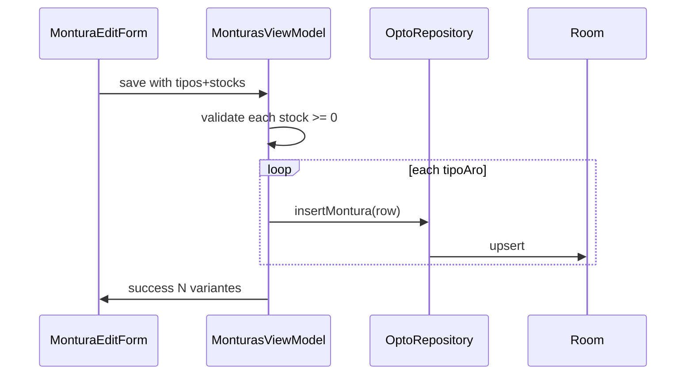

# Design — montura-tipo-aro-stock-variants

## Architecture decisions

### ADR-1: Uniqueness `(optica, sku, tipo_aro)`

- **Why**: Same catalog SKU, independent stock per rim construction.
- **How**: Drop `index_monturas_sku_opticaId` / `idx_monturas_sku_optica`; create `index_monturas_sku_opticaId_tipoAro` / `idx_monturas_sku_optica_tipo_aro`.
- **Accessories**: `tipoAro = ""` → still one row per SKU.

### ADR-2: Multi-insert on create only

- Form state: `selectedTiposAro: Set<String>`, `stockPorTipoAro: Map<String, String>`.
- Edit path: single `tipoAro` + `stockActual` (unchanged UX).
- ViewModel loops `insertMontura` per selected tipo.

### ADR-3: Shared search component

- Update `monturaLabel` → `Marca Modelo (SKU) · TipoAro` when tipo present.
- `MonturaSearchField` subtitle includes tipoAro; filter matches tipoAro text.
- Dispensación / servicios get behavior for free.

### ADR-4: Material catalog

- Add `OpticalCatalog.MATERIALES_MONTURA` (Acetato, Metal, Carey, TR-90, Econ, Aluminio).
- Wire inventory + dispensación forms to it (`MATERIALES` stays lens materials).

## Sequence — create with two tipos

## Sync

Upload/download keyed by montura `id`. No sync order change. Unique conflict message: mention SKU+tipo when UNIQUE fires.

## Room version

51 → 52 via `MIGRATION_51_52`.
