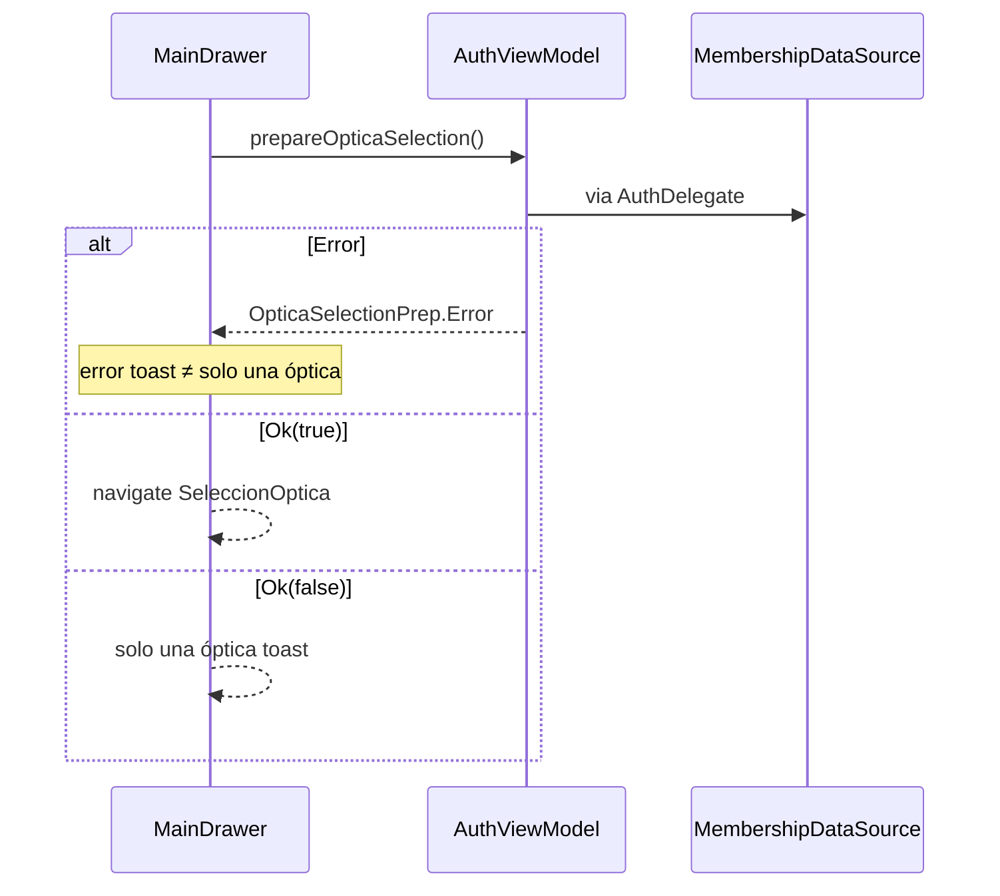
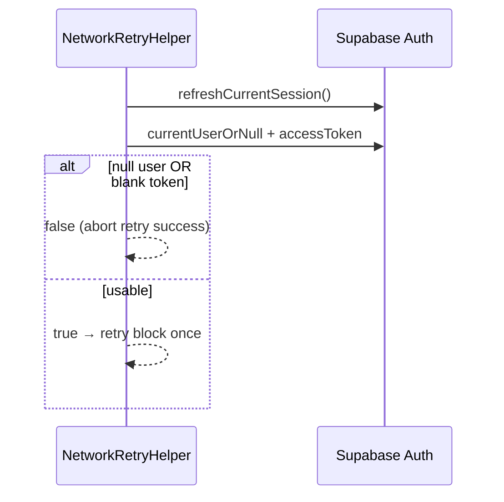

# Design: Fix Auth Membership JWT

## Technical Approach

Surgical fail-closed quartet (Approach 1): JD2-C6 DTO privilege fail-open, JD2-C7 JWT retry without post-refresh proof, null GoTrue → Error, drawer Error → “solo una óptica”. Specs: `android-auth-onboarding` (Blank Role + Error≠Empty), `android-auth` (JWT Sync Retry Fail-Closed). Keep `coerceInputValues = true`. OUT: C8 PIN, deeplink/recovery.

## Architecture Decisions

| Decision | Options | Tradeoff | Choice |
|----------|---------|----------|--------|
| C6 fix | DTO `""` vs required-rol vs disable coerce | Required fails whole list; coerce collaterals | **`UsuarioOpticaDto.rol = ""`** + `mapRow` skip; coerce stays |
| Null GoTrue | Empty vs Error | Empty → onboarding; siblings use Sin sesión | **`Error(IllegalStateException("Sin sesión"))`** |
| Selector API | MembershipFetch vs Boolean vs sealed | Boolean collapses Error; Fetch leaks data layer | **`OpticaSelectionPrep.Ok(hasMultiple)` / `Error(message)`** |
| Single toast | Ok(false) keeps toast vs silence Empty | Spec only forbids Error→single toast | **Ok(false) unchanged**; Error → error toast |
| C7 check | SyncSessionHelper vs inline | Helper does full preflight+margin | **Inline**: non-null user + non-blank accessToken |
| DB blank rol | Skip vs admin | DB `NOT NULL DEFAULT 'admin'` | **Skip** (defensive; no schema change) |

## Data Flow

```
JSON row → UsuarioOpticaDto(rol="") → mapRow blank-skip → Ok|Empty
uid null → Error → flagsFor: no onboarding / no clearSession
```





## File Changes

| File | Action | Description |
|------|--------|-------------|
| `data/MembershipRepositoryDtos.kt` | Modify | `rol` default → `""` |
| `data/membership/MembershipDataSource.kt` | Modify | null uid → Error Sin sesión |
| `viewmodel/AuthViewModel.kt` | Modify | return `OpticaSelectionPrep` |
| `ui/screens/MainDrawerScreen.kt` | Modify | Error toast; navigate only Ok(true) |
| `domain/NetworkRetryHelper.kt` | Modify | post-refresh user+token guard |
| `SyncSessionHelper` / `SupabaseModule` | Unchanged | pattern / coerce stay |
| `MembershipRepositoryDtosTest.kt` | Modify | defaultRol=`""`; decode missing/null |
| `MembershipRepositoryErrorTest.kt` | Modify | no-session → Error |
| `MembershipRepositoryTest.kt` | Modify | noSession → Error |
| `AuthViewModelTest.kt` | Modify/Add | prep Error/Ok contracts |
| `NetworkRetryHelperTest.kt` | Modify/Add | stub user+token on happy JWT; RED anon/blank |

Colocate `OpticaSelectionPrep` next to AuthViewModel. Leave `AuthDelegate.prepareOpticaSelection` / wait-screen `-1` unchanged.

## Interfaces / Contracts

```kotlin
sealed class OpticaSelectionPrep {
    data class Ok(val hasMultiple: Boolean) : OpticaSelectionPrep()
    data class Error(val message: String) : OpticaSelectionPrep()
}

// VM: Error → Error(cause.message ?: "Error al cargar ópticas"); Empty/Ok → Ok(size>1)
// NetworkRetryHelper after refresh:
//   currentUserOrNull() ?: return false
//   currentSessionOrNull()?.accessToken.isNullOrBlank() → false; else true
```

## Testing Strategy

| Layer | What | Approach |
|-------|------|----------|
| Unit TDD | missing/null rol ≠ admin; mapRow skip | Json decode + DtosTest |
| Unit TDD | null uid → Error; no onboarding | MembershipRepository*Test |
| Unit TDD | Prep Error ≠ Ok(false) | AuthViewModelTest |
| Unit TDD | anon/blank token → false; happy retries | NetworkRetryHelperTest stubs |

Order: C6 → C7 → null-user → prep/drawer. Each RED→GREEN.

## Threat Matrix

N/A — no routing/shell/subprocess/VCS/process-integration boundary.

## Migration / Rollout

No migration. DB confirmed `usuario_optica.rol TEXT NOT NULL DEFAULT 'admin'`. Rollback: revert quartet + tests one commit.

## Open Questions

- [ ] Exact Error toast copy — default cause/`"Error al cargar ópticas"`; apply may tighten
