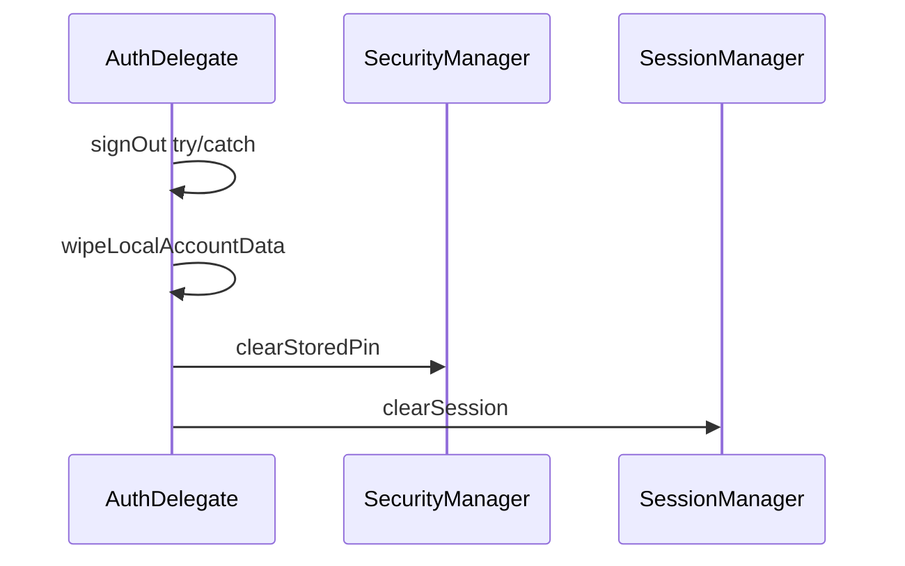

# Design: Fix Auth PIN Logout (JD2-C8)

## Technical Approach

Close JD2-C8 and the CreatePin fire-and-forget race with locked **Approach 1**: wipe device PIN secret + `pref_pin_has_been_set` on logout (dual writers), and await successful Create PIN persist before Main. Maps to `android-auth` delta. PIN stays optional. Out: C6/C7, mandatory PIN, per-uid keying, `SignOutScope` / `launchMode`.

## Architecture Decisions

| Decision | Options | Tradeoff | Choice |
|----------|---------|----------|--------|
| Cross-account PIN | Wipe on logout vs per-uid keys vs flag-only | Flag-only leaves secret; per-uid is large prefs work | **`ISecurityManager.clearStoredPin()`** (secret + flag + `_pinFlow`) |
| Dual readers | SM only vs Session only vs both | Settings→SessionManager; PinDelegate→SecurityManager; same DataStore key | **Both**: wipe in `clearStoredPin` **and** `prefs.remove(PIN_HAS_BEEN_SET)` in `clearSession` |
| Logout call site | PinDelegate wrapper vs AuthDelegate→SM | AuthDelegate already injects `ISecurityManager`; Room wipe lives here | **`AuthDelegate.logout` → `clearStoredPin()`** after Room wipe, before/with `clearSession` |
| Remote signOut | Gate wipe on success vs always | Spec: wipe despite non-cancellation remote failures | **Always wipe locally** (rethrow `CancellationException` only) |
| Create PIN API | suspend `Boolean` vs `createPinAwaitingSuccess` | Screen needs success; mirror deeplink await pattern | **`PinDelegate.createPin`→`Boolean`**; **`AuthViewModel.createPinAwaitingSuccess`** suspend |
| Navigate gate | Observe Flow vs return Boolean | Flow races collectors | **Navigate Main only on `true`**; stay + error on `false` |
| Product default | Mandatory vs optional PIN | C3-Default-PIN out of scope | **Optional PIN unchanged** |

## Data Flow

```
logout
  ├─ signOut(GLOBAL)                 // errors ignored except CancellationException
  ├─ wipeLocalAccountData()          // Room (existing)
  ├─ securityManager.clearStoredPin() // NEW: user_pin + flag + _pinFlow=""
  └─ sessionManager.clearSession()   // + remove PIN_HAS_BEEN_SET; isPinRequired=false

CreatePin confirm → createPinAwaitingSuccess(pin) → if true navigate Main else stay
```



**Invariant:** After logout, `migratePinHasBeenSet` must not re-elevate — secret empty when flag is false.

## File Changes

| File | Action | Description |
|------|--------|-------------|
| `optoapp/.../data/SecurityManager.kt` | Modify | `clearStoredPin` on interface + impl |
| `optoapp/.../data/SessionManager.kt` | Modify | `clearSession` removes `PIN_HAS_BEEN_SET` |
| `optoapp/.../viewmodel/auth/AuthDelegate.kt` | Modify | Call `clearStoredPin` on logout |
| `optoapp/.../viewmodel/auth/PinDelegate.kt` | Modify | `createPin` returns `Boolean` |
| `optoapp/.../viewmodel/AuthViewModel.kt` | Modify | `suspend fun createPinAwaitingSuccess(pin): Boolean` |
| `optoapp/.../ui/screens/CreatePinScreen.kt` | Modify | Await success before Main |
| `.../viewmodel/PinDelegateTest.kt` | Modify | Fake `clearStoredPin`; Boolean createPin |
| `.../viewmodel/AuthDelegateTest.kt` / logout test | Modify/Create | `coVerify clearStoredPin` when signOut IOException |
| `.../data/SessionManagerTest.kt` | Modify | clearSession → `pinHasBeenSet=false` |
| `.../data/SecurityManagerTest.kt` or Fake | Modify/Create | clear → empty secret + flag false |
| `.../androidTest/.../SecurityManagerInstrumentedTest.kt` | Optional | ESP wipe smoke |
| `openspec/specs/android-auth/spec.md` | Modify | Merge delta at archive |

## Interfaces / Contracts

```kotlin
interface ISecurityManager {
    val userPin: Flow<String>
    val pinHasBeenSet: Flow<Boolean>
    suspend fun savePin(pin: String)
    suspend fun clearStoredPin()
}
// clearStoredPin: remove user_pin; _pinFlow=""; DataStore flag=false
// PinDelegate.createPin: false if !isValidPin else savePin→true
suspend fun createPinAwaitingSuccess(pin: String): Boolean = pinDelegate.createPin(pin)
```

## Testing Strategy

| Layer | What to Test | Approach |
|-------|-------------|----------|
| Unit RED→GREEN | `clearStoredPin` empties secret + flag | Fake / characterization |
| Unit | logout calls wipe when signOut throws | MockK `coVerify` |
| Unit | `clearSession` → pinHasBeenSet false | SessionManager contract |
| Unit | invalid PIN → false; no navigate | PinDelegate + AuthViewModel |
| Optional instrumented | ESP wipe | SecurityManagerInstrumentedTest |
| Regression | Optional-PIN PostLoginNavigation | Existing nav tests |

Strict TDD: RED wipe → RED logout verify → RED clearSession flag → RED await Boolean → GREEN → CreatePinScreen gate.

## Threat Matrix

N/A — no routing, shell, subprocess, VCS/PR automation, executable-file classification, or process-integration boundary.

## Migration / Rollout

No migration required. Local prefs only. Rollback: revert PR. No Supabase schema/RLS.

## Open Questions

- [ ] Non-blocking: reset PinDelegate cooldown on logout (optional follow-up)
- [ ] Non-blocking: SettingsViewModel `isPinRequired` stateIn default vs SessionManager (out of scope)
