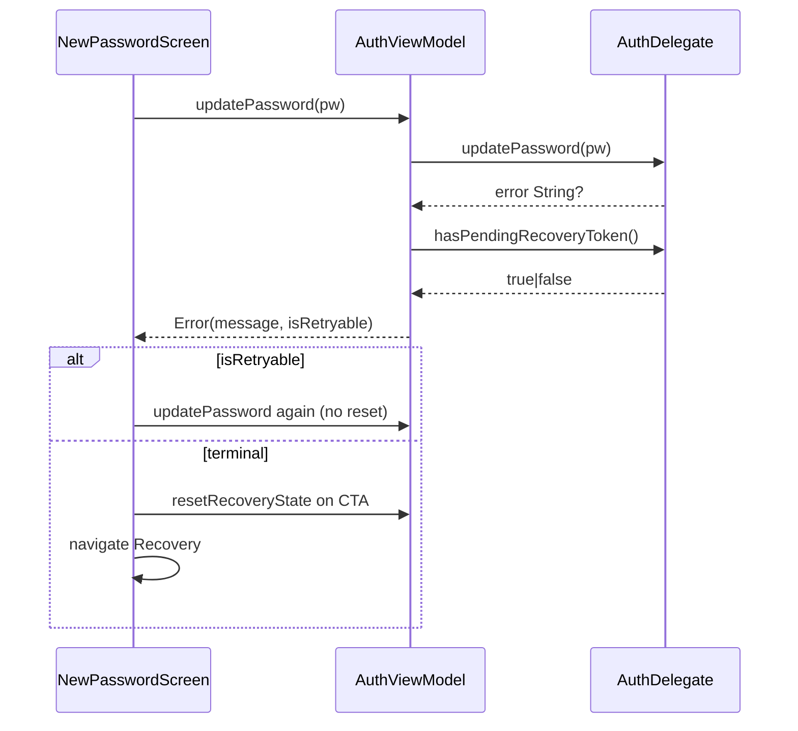

# Design: Fix Auth Recovery Regressions (Part 2a)

## Technical Approach

Close JD2-C2/C3 only: wire Part 1 Delegate token keep/clear into `RecoveryState.Error(isRetryable)` and NewPassword UI, and stop Login entry from calling `resetRecoveryState`. Spec delta `android-password-recovery` (retryability + explicit-exit excluding Login mount). No Delegate taxonomy rewrite; no MainActivity C4/C5; no Parts beyond C2/C3.

## Architecture Decisions

| Decision | Options | Tradeoff | Choice |
|----------|---------|----------|--------|
| Error shape | `Error(isRetryable)` vs UI polls token vs sealed Retryable/Terminal | Flag: small, VM-testable; poll: UI owns taxonomy; sealed: churn | **`Error(message, isRetryable)`** |
| Retry source of truth | HTTP parse in VM vs `hasPendingRecoveryToken()` | Parse drifts from Delegate; token matches keep/clear | **Post-fail `hasPendingRecoveryToken()`** |
| Blank / non-updatePassword Errors | Always false vs infer | sendRecoveryEmail / deep-link / blank-token must be terminal | **`isRetryable=false`** (default) |
| Login stale guard | Remove entry reset vs conditional skip vs nav-arg | Conditional still races; nav-arg touches all sites | **Delete Login entry reset** |
| Delegate surface | Taxonomy rewrite vs read-only | Rewrite out of scope | **Read-only**; call existing `hasPendingRecoveryToken` (module-`internal` OK) |
| MainActivity | Fix C4/C5 vs leave | Adjacent cold-start risk | **Do not touch** |

## Data Flow

```
updatePassword fail
  └─ AuthDelegate keep|clear token (Part 1 — unchanged)
       └─ VM: Error(msg, isRetryable = hasPendingRecoveryToken())
            ├─ true  → NewPassword: form + banner + Guardar/retry (no reset)
            └─ false → NewPassword: terminal CTA → reset + Recovery (no auto-nav)

Cold-start deep link → Login compose
  └─ LaunchedEffect: load remembered email ONLY (no resetRecoveryState)
```



## File Changes

| File | Action | Description |
|------|--------|-------------|
| `optoapp/.../viewmodel/AuthViewModel.kt` | Modify | `Error(message, isRetryable: Boolean = false)`; after failed `updatePassword` set flag from `hasPendingRecoveryToken()`; other Error sites keep default `false` |
| `optoapp/.../ui/screens/NewPasswordScreen.kt` | Modify | Terminal Error only when `!isRetryable`; retryable Error stays on form branch with message banner; Guardar retries without reset |
| `optoapp/.../ui/screens/LoginScreen.kt` | Modify | Remove `resetRecoveryState()` from entry `LaunchedEffect`; keep remembered-email load |
| `optoapp/.../viewmodel/auth/AuthDelegate.kt` | Unchanged | Taxonomy untouched |
| `MainActivity.kt` / `RecoveryScreen.kt` | Unchanged | Out of scope |
| `.../viewmodel/RecoveryStateTest.kt` | Modify | Equality / holds `isRetryable` |
| `.../viewmodel/AuthViewModelTest.kt` | Modify | Stub `hasPendingRecoveryToken`; assert `isRetryable` true/false; blank-token → false |
| Optional NewPassword/Login unit helper | Modify/Create | Only if needed to lock retryable-form vs no Login-entry reset (prefer VM-first TDD) |

## Interfaces / Contracts

```kotlin
data class Error(
    val message: String,
    val isRetryable: Boolean = false,
) : RecoveryState()

// AuthViewModel.updatePassword failure path only:
_recoveryState.value = RecoveryState.Error(
    message = error,
    isRetryable = authDelegate.hasPendingRecoveryToken(),
)
```

NewPassword: `when` — `PasswordUpdated` | terminal `Error(!isRetryable)` | else form (if `Error(isRetryable)` show banner from `message`).

## Testing Strategy

| Layer | What to Test | Approach |
|-------|-------------|----------|
| Unit (RED→GREEN first) | `updatePassword` → `Error(isRetryable=true\|false)` from stubbed token presence; blank-token false; retry calls update twice without `clearPendingRecoveryToken`/`reset` | `AuthViewModelTest` + MockK (`every { hasPendingRecoveryToken() }`) — **relaxed Boolean defaults false** |
| Unit | `RecoveryState.Error` equality includes `isRetryable` | `RecoveryStateTest` |
| Unit / screen | Retryable keeps form path; Login entry does not invoke reset | Lightweight assertion or characterization; no Robolectric required |
| Integration/E2E | Out of Part 2a | Manual cold-start deep link smoke optional |

Strict TDD: fail VM contracts → green VM → green NewPassword/Login wiring.

## Threat Matrix

N/A — no routing, shell, subprocess, VCS/PR automation, executable-file classification, or process-integration boundary.

## Migration / Rollout

No migration required. Client-only UI/VM. Rollback: revert this change’s Android commits.

## Open Questions

- None blocking. Accepted residual: stale `EmailSent`/`Error` if user leaves Recovery without Back/CTA after Login entry reset removal.
