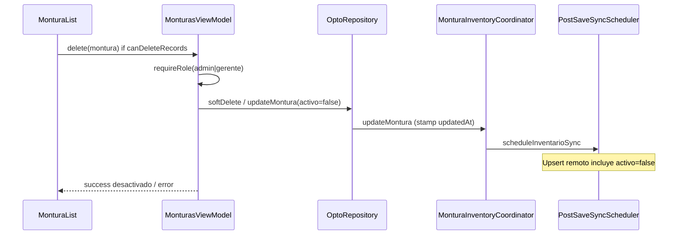
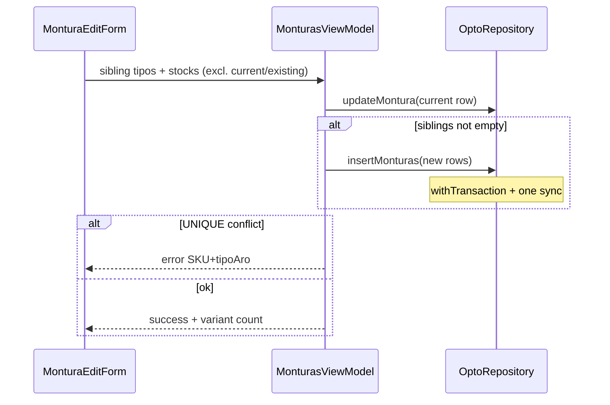

# Design: Fix Montura Edit Tipo Aro & Delete

## Technical Approach

Align edit UX with create chips/`OptoDropdownMenuField`, soft-delete monturas like proveedores (sync-safe), amend ADR-2 with edit→sibling spawn via existing `insertMonturas`, and CASCADE child FKs (Room 52→53 + Supabase) as a hard-delete safety net only. Soft-delete remains the sole UI delete path. Post-`sdd-verify`, orchestrator runs Judgment Day before archive/push.

## Architecture Decisions

### Decision: Edit tipo aro + material controls

| Option | Tradeoff | Decision |
|--------|----------|----------|
| Exclusive FilterChips → `form.tipoAro` | Matches catalog; single-select vs create multi | **Chosen** |
| Keep `DropdownField` | Deprecated; hard to open | Rejected |
| Inline multi-chip on edit | Confuses change-vs-add | Rejected |

**Material**: replace `DropdownField` with `OptoDropdownMenuField` (same pattern as dispensación). Accesorio path unchanged (hides aro/material).

### Decision: Soft-delete policy

| Option | Tradeoff | Decision |
|--------|----------|----------|
| `activo=false` + `updateMontura` + sync | UNIQUE slot retained; sync-safe | **Chosen** |
| Hard delete + CASCADE as UX | Wipes OC/IF lines; no remote tombstone | Rejected |
| Soft-delete without list filter | Inactive rows stay visible | Rejected |

**API**: `softDeleteMontura` on coordinator (or `updateMontura` with `activo=false`); `updatedAt` stamp inside update path; `scheduleInventarioSync`. VM `delete`: try/catch (auth + DB), Spanish error, success “desactivado”. UI Delete gated by `AppRoles.canDeleteRecords`; dialog deactivate copy. `sortedMonturas` filters `activo`. Keep hard `deleteMontura` internal/unused by UI.

### Decision: Edit sibling spawn (ADR-2 amend)

| Option | Tradeoff | Decision |
|--------|----------|----------|
| CTA “Añadir variante” + `insertMonturas` | Reuses create path; stays on edit | **Chosen** |
| Prefill create screen | Leaves edit | Rejected |
| Inline multi-chip edit | Ambiguous mutate vs insert | Rejected |

CTA (non-accesorio): multi-select catalog tipos **minus** current `tipoAro` and tipos already present for same SKU+optica (from `monturas` flow). Per-tipo stock fields. Save: persist current row edits first (`updateMontura`), then `insertMonturas` for siblings sharing sku/marca/modelo/costo/precio/stockMinimo/material (+ color/talla/dims as on create). UNIQUE → existing “El SKU ya existe para ese tipo de aro.” Stay on original edit or close with success naming variant count.

### Decision: CASCADE FKs Room + Supabase

| Option | Tradeoff | Decision |
|--------|----------|----------|
| CASCADE OC items + IF detalle | Safety net; history loss on hard DELETE | **Chosen** |
| SET NULL | Needs nullable `monturaId` | Rejected |
| CASCADE as UI delete | Destructive; sync gap | Rejected |

Room: entity `onDelete = CASCADE`; `MIGRATION_52_53` rebuild `orden_compra_items` + `inventario_fisico_detalle` (SQLite cannot ALTER FK). Supabase: drop/recreate FKs with `ON DELETE CASCADE` (GGA before remote). Soft-delete never fires CASCADE.

### Decision: Post-verify Judgment Day

Orchestrator gate after successful `sdd-verify`, before archive/push. Not application code.

## Data Flow

### Soft-delete



### Sibling spawn



## File Changes

| File | Action | Description |
|------|--------|-------------|
| `ui/components/monturas/MonturaForm.kt` | Modify | Exclusive chips; OptoDropdownMenuField; sibling CTA UI state |
| `ui/screens/MonturasScreen.kt` | Modify | `canDeleteRecords`; sibling CTA wiring |
| `ui/components/monturas/MonturaList.kt` | Modify | Separate `canDelete`; deactivate dialog copy |
| `viewmodel/MonturasViewModel.kt` | Modify | Soft-delete try/catch; activo filter; sibling save |
| `data/montura/MonturaInventoryCoordinator.kt` | Modify | `softDeleteMontura` via update path |
| `data/OptoRepository.kt` | Modify | Facade soft-delete; reuse `insertMonturas` |
| `data/ordencompra/OrdenCompraEntity.kt` | Modify | montura FK CASCADE |
| `data/inventariofisico/InventarioFisicoEntity.kt` | Modify | montura FK CASCADE |
| `data/OptoDatabase.kt` | Modify | version 53; register migration |
| `data/OptoDatabaseMigrations.kt` | Modify | `MIGRATION_52_53` table rebuilds |
| `supabase/migrations/*_montura_fk_cascade.sql` | Create | ALTER FKs CASCADE (GGA) |
| `openspec/specs/inventario-stock/spec.md` | Modify | Deltas: chips, soft-delete, sibling, FK policy |
| `test/.../MonturasViewModelTest.kt` | Modify | Soft-delete, roles, sibling, UNIQUE |
| `test/.../Migration52To53Test.kt` | Create | Assert CASCADE SQL + registration |

## Interfaces / Contracts

```kotlin
// Coordinator — soft-delete mirrors ProveedorRepository.softDelete
suspend fun softDeleteMontura(montura: Montura) // activo=false via updateMontura + sync

// Form state additions (edit sibling panel)
// siblingTiposAro: Set<String>, siblingStockPorTipo: Map<String, String>
```

No new Room tables. UNIQUE `(sku, opticaId, tipoAro)` unchanged.

## Testing Strategy

| Layer | What to Test | Approach |
|-------|-------------|----------|
| Unit | Soft-delete stamps activo + sync; unauthorized role; catch→error; sibling insert; UNIQUE message; sorted list hides inactive | JUnit4 + MockK `MonturasViewModelTest` |
| Unit | Migration 52→53 SQL has CASCADE FKs; registered on DB | `Migration52To53Test` (MockK `execSQL` capture) |
| Integration | N/A this change | — |
| E2E | N/A | Manual: edit chip, deactivate, add variant |

Strict TDD: RED tests before apply.

## Threat Matrix

N/A — no routing, shell, subprocess, VCS/PR automation, executable-file classification, or process-integration boundary.

## Migration / Rollout

1. App soft-delete + UX + sibling first (or same release as CASCADE).
2. Room `MIGRATION_52_53` with APK.
3. Supabase FK CASCADE only after **GGA**; prefer app soft-delete live before or with remote.
4. Chained PRs likely (UX/delete vs schema) — forecast in `sdd-tasks` (>400 lines).
5. Judgment Day after `sdd-verify`.

Rollback: revert app commits; reverse Supabase FK under GGA. Avoid mixed hard-delete clients.

## Open Questions

- [x] Soft-delete vs CASCADE UX — locked: soft-delete only in UI
- [x] Sibling stays on edit vs navigate — prefer stay/close with success; no create navigation
- [ ] Exact sibling CTA placement (form vs edit top bar) — implementer’s choice within edit screen
