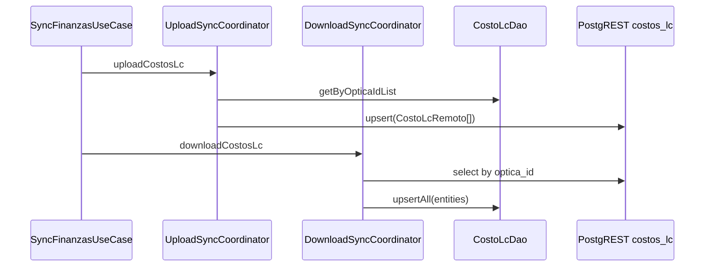

# Design: Finanzas Oleada B — sync costos_lc + UI Biselado/LC

**Change**: `finanzas-oleada-b-costos` · **Issue**: #106 · **RDD**: `rdd_mode=disabled/unmanaged`  
**Delivery**: `auto-chain`, WUs ≤400 · **Schema/RLS**: verify only · **PagoEffect**: untouched

## Technical Approach

Clone live `costos_biselado` sync into `costos_lc`; replace CostosYGastos tab 1–2 stubs with Tab-0-style soft-delete CRUD; retarget Dispensacion LC snapshot from `CostoProductoDao.lookupLc` → `CostoLcDao.lookup`. Specs: NEW `costos-lc`; DELTA `sync`; DELTA `costos-productos` R5.

## Architecture Decisions

| Decision | Options | Choice | Rationale |
|----------|---------|--------|-----------|
| Sync shape | Custom; half-wire | **Clone biselado**: `CostoLcRemoto` + `uploadCostosLc` / `downloadCostosLc` after biselado | Identical coordinator pattern; lowest surprise |
| Download deletions | Soft remote delete push | **`skipDeletions = true`** (same as biselado) | Soft-delete via `vigente_hasta` upsert |
| Biselado list | One-shot; Flow | **Add `Flow getByOpticaId` on `CostoBiseladoDao`** (mirror `CostoLcDao`) | Live list after upsert without manual reload bugs |
| Soft-delete | Hard DELETE; DAO helper | **`entity.copy(vigenteHasta=today)` + `upsertAll`** | Matches productos CRUD; sync propagates |
| LC catalog | Hardcode in Screen | **`OpticalCatalog.TIPOS_LC` + `MODALIDADES_LC`** (+ materials reuse/list) | Mirror Postgres CHECKs; UI dropdowns |
| LC snapshot keys | Keep lookupLc; expand eval schema | **Map from `item.tipoLente` → `tipo_lc` (Cosmét→cosmetico, Medida/Graduado→graduado, Terap→terapeutico); material/lab from eval/item; modalidad default `mensual`** | Eval `lcTipoLente` is Blanda/RGP taxonomy ≠ CHECK; no modalidad column — OUT to add |
| `lookupLc` removal | Delete now; leave dead | **Leave method**; stop calling from Disp | Avoid unify-optical-catalog scope |
| Role gate | New policy | **Keep Oleada A `CostosGastosUiPolicy`** | BI ⊆ admin/gerente for RLS writes |
| Schema | Always migrate | **Verify remote table; no migration if present** | Migration already in repo |
| Screen size | Monolith edits | **Private composables per tab**; chain PRs | ≤400 LOC review budget |

## Data Flow

```
SyncFinanzas
  upload: … → costos_productos → costos_biselado → costos_lc → pagos → …
  download: … → costos_productos → costos_biselado → costos_lc → pagos → …

CostosYGastos tab1/2
  Flow(list) ──► UI list
  FAB/edit/delete ──► upsertAll ──► postSaveSyncScheduler.scheduleFinanzasSync

Dispensacion link-eval
  isLc? ──► mapTipoLc + material + modalidad(default mensual)
         ──► CostoLcDao.lookup ──► item.costoRealLc ?: unitario
```



## File Changes

| File | Action | Description |
|------|--------|-------------|
| `domain/SyncFinanzasDto.kt` | Modify | `CostoLcRemoto`, mappers, result counters |
| `domain/UploadSyncCoordinator.kt` | Modify | Inject `CostoLcDao`; `uploadCostosLc` |
| `domain/DownloadSyncCoordinator.kt` | Modify | Inject `CostoLcDao`; `downloadCostosLc` |
| `domain/SyncFinanzasUseCase.kt` | Modify | safeUpload/Download after biselado; wire counters |
| `data/costobiselado/CostoBiseladoDao.kt` | Modify | Add `Flow getByOpticaId` |
| `domain/OpticalCatalog.kt` | Modify | LC tipo/modalidad (+ materials if needed) |
| `viewmodel/CostosYGastosViewModel.kt` | Modify | Inject `CostoLcDao`; tab1/2 state+CRUD |
| `ui/screens/CostosYGastosScreen.kt` | Modify | Replace stubs with list+dialogs |
| `viewmodel/DispensacionViewModel.kt` | Modify | Inject `CostoLcDao`; retarget LC branch |
| Tests: SyncFinanzas*, Upload/Download*, CostosYGastos*, CostoLcDao*, Disp* | Modify/Create | Strict TDD |

**Untouched**: `PagoEffect.kt`; cierre/P&L/config financiera; DrawerSections; migrations unless verify fails; `lookupLc` body.

## Interfaces / Contracts

```kotlin
@Serializable
data class CostoLcRemoto(
    val id: String,
    @SerialName("optica_id") val opticaId: String,
    @SerialName("tipo_lc") val tipoLc: String,
    @SerialName("material_lc") val materialLc: String,
    val modalidad: String,
    @SerialName("radio_base") val radioBase: String? = null,
    val diametro: String? = null,
    @SerialName("laboratorio_id") val laboratorioId: String? = null,
    @SerialName("costo_unitario") val costoUnitario: Double,
    @SerialName("vigente_desde") val vigenteDesde: String,
    @SerialName("vigente_hasta") val vigenteHasta: String? = null,
)

// FinanzasSyncResult += uploadedCostosLc / downloadedCostosLc
// mapTipoLc("Cosmético"|"Graduado"|"Terapéutico"|…) → cosmetico|graduado|terapeutico
```

## Testing Strategy

| Layer | What | Approach |
|-------|------|----------|
| Unit | DTO round-trip | `SyncFinanzasCostosTest` |
| Unit | Upload/download order + empty | Coordinator + UseCaseKt mocks |
| Unit | Tab CRUD soft-delete/validation | `CostosYGastosViewModelTest` |
| Unit | LC snapshot map + `?:` | Dispensacion VM test |
| Room | `CostoLcDao.lookup` / list | In-memory `CostoLcDaoTest` |

## Threat Matrix

N/A — no routing/shell/subprocess/VCS/PR/exec-classification boundaries. Compose UI + Room + PostgREST only.

## Migration / Rollout

1. Verify prod `costos_lc` exists (SQL/MCP). If missing → apply existing migration only.  
2. Chain: **WU-Sync → WU-UI-Biselado → WU-UI-LC → WU-Snapshot**.  
3. Do not ship UI without Snapshot (or explicit follow-up issue).  
Rollback = revert PR slice; Room entity stays.

## Open Questions

- [x] Modalidad on eval missing → default `mensual` when unset; document in VM mapper
- [ ] Confirm BI role set ⊆ RLS admin/gerente before first multi-device write test
