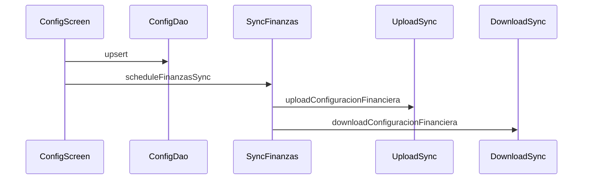

# Design: Finanzas Oleada D — config financiera + P&L + resumen_diario

**Change**: `finanzas-oleada-d-bi` · **Issue**: #108 · **RDD**: `rdd_mode=disabled/unmanaged`  
**Delivery**: `auto-chain`, WUs ≤400 · **Schema**: verify only · **PagoEffect**: untouched

## Technical Approach

Config UI + upload; Analisis P&L block; resumen_diario list; Reportes spec→PagoEffect. Specs: NEW `configuracion-financiera`; DELTAs `reportes-financieros`, `analisis-negocio`, `sync`, `indicadores-negocio`.

## Architecture Decisions

| Decision | Options | Choice | Rationale |
|----------|---------|--------|-----------|
| Config placement | Analisis-only; standalone | **Section under Configuracion or dedicated screen + nav** | Matches settings mental model; admin/gerente gate |
| Upload shape | Batch rewrite | **Single-row upsert like gastos** | Existing DTO; add `toRemoto()` |
| Upload order | After download | **Upload before download config** | Prevents clobber |
| P&L COGS online | New RPC field only | **`ventasMes − costoDeVentas() − gastosMes`** (+ parse `costo_mes` into `costoMes` if useful) | Uses live AnalisisMensual |
| Offline P&L | Zeros forever | **Compose resumen costo + gastos month; `esOffline` banner** | Honest UX |
| Resumen UI | Widget only | **Read-only month list + detail; refresh→finanzas sync** | Dao Flow exists |
| Reportes work | Code rewrite | **Spec delta + characterization if gaps** | VM already PagoEffect |
| Roles | canViewBiAndReports | **admin/gerente for writes** (align RLS) | Matches R7.1 |

## Data Flow

```
Config UI ─upsert─► ConfiguracionFinancieraDao ─scheduleFinanzasSync─►
  UploadSync.uploadConfiguracionFinanciera ─► PostgREST
  DownloadSync.downloadConfiguracionFinanciera ─► Dao

rpc_analisis_mensual ─► AnalisisMensual ─► P&L block
offline: ResumenDiarioDao + GastoOperativoDao ─► esOffline AnalisisMensual

ResumenDiarioDao.Flow(month) ─► Resumen list UI
refresh ─► SyncFinanzas (recalc RPC + download)
```



## File Changes

| File | Action | Description |
|------|--------|-------------|
| `ui/.../ConfiguracionFinanciera*` or Config section | Create/Modify | Editors + gate |
| `viewmodel/ConfiguracionFinancieraViewModel.kt` | Create | Load Flow, save, sync |
| `domain/SyncFinanzasDto.kt` | Modify | `toRemoto()`; upload counter |
| `domain/UploadSyncCoordinator.kt` | Modify | `uploadConfiguracionFinanciera` |
| `domain/SyncFinanzasUseCase.kt` | Modify | Wire upload before download |
| `repository` / post-save | Modify | User upsert schedules sync |
| `ui/screens/AnalisisNegocioScreen.kt` | Modify | P&L block |
| `domain/ObtenerAnalisisMensualUseCase.kt` | Modify | Offline compose |
| `domain/AnalisisMensual.kt` | Modify | Optional `costoMes` from RPC |
| Resumen screen/subsection | Create | Month list |
| Specs under change folder | Done | Deltas |
| Tests | Create/Modify | Strict TDD |

**Untouched**: `PagoEffect.kt`; cierre export; Oleada B cost tabs; resumen upload; new migrations unless verify fails.

## Interfaces / Contracts

```kotlin
fun ConfiguracionFinancieraEntity.toRemoto(): ConfiguracionFinancieraRemoto
// FinanzasSyncResult += uploadedConfiguracionesFinancieras
// AnalisisMensual.costoMes: Double = 0.0  // from costo_mes / offlineDeVentas fallback
```

## Testing Strategy

| Layer | What | Approach |
|-------|------|----------|
| Unit | Spec PagoEffect scenarios | Characterization / Reportes VM |
| Unit | Upload order + empty | Coordinator + UseCase mocks |
| Unit | Config save gate + validation | VM tests |
| Unit | Offline P&L compose | UseCase + fakes |
| Unit | Resumen month Flow | Dao Room in-memory / VM |

## Threat Matrix

N/A — no routing/shell/subprocess/VCS/exec boundaries beyond existing sync.

## Migration / Rollout

1. Verify RLS write admin/gerente on prod config table.  
2. Chain: **WU-Spec-Reportes → WU-Config → WU-PnL → WU-Resumen**.  
3. Do not ship config UI without upload.  
Rollback = revert PR slices.

## Open Questions

- [ ] Exact nav entry for config (ConfiguracionScreen section vs drawer item)
- [ ] Confirm prod RLS matches R7.1 before first write test
